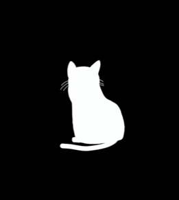

  
  
  

  
  
   

<h2 align="center">  <em>About  me </em></h2>

 

  ​Olá! <em><b> Eu sou Rayanne Melo </b></em> <em><b>(ou Amy<b></em> para os mais próximos).Sou estudante de Ciência da Computação e entusiasta da arte digital. Adoro unir a lógica do código com a criatividade do design. Atualmente, estou aprofundando meus estudos em Gestão de Bancos de Dados e lógica de backend, transformando problemas complexos em sistemas funcionais

 

   <em><b> Desenvolvedora Fullstack </b></em> 
   <em><b> Estudando na Faculdade  Anhanguera </b></em>  
   <em><b></b> Jogadora de Minecraft & Entusiasta de Automação com Redstone </em> 
   <em><b> Habilidade em Ambientes de Desenvolvimento Mobile (Termux/Linux) </b></em> 

 
 
<h2 align="center">  <em> Technologies </em> </h2>

  
  
  
  
  
  
  

 

<h2 align="center"">  <em> Statistics </em> </h2>

 

